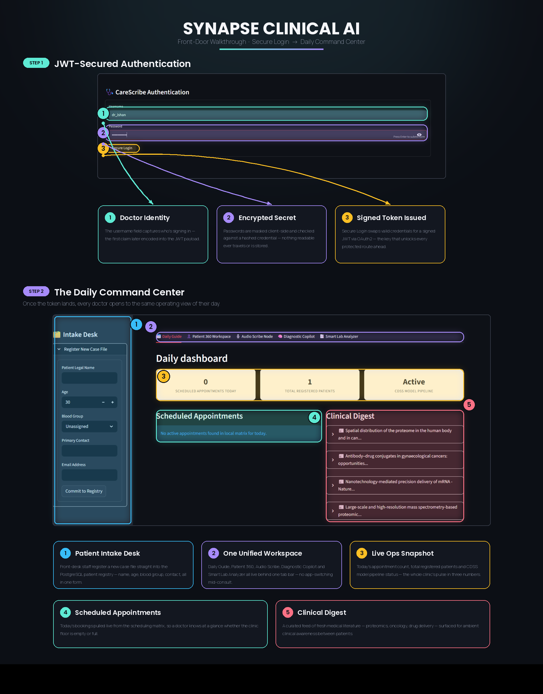
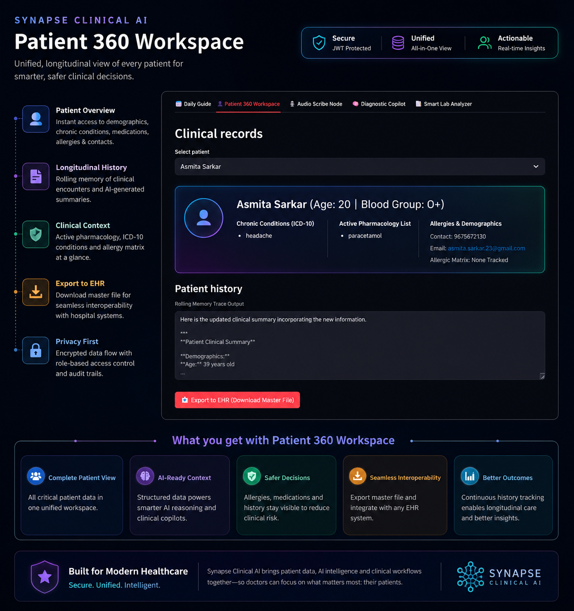
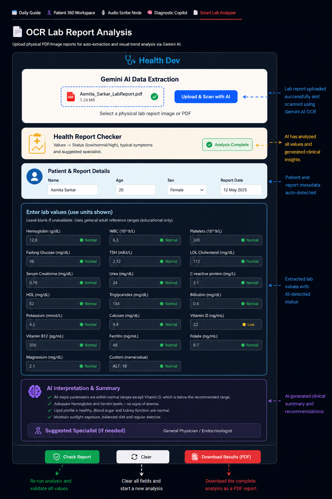

# 🖥️ Platform Walkthrough

Explore how **Synapse Clinical AI** streamlines the complete clinical workflow—from secure authentication and patient management to AI-powered documentation and intelligent laboratory report analysis.

---

# 🔐 Secure Authentication & Daily Command Center

Every clinical session begins with a secure JWT-authenticated login before granting access to the central command center.

After successful authentication, clinicians are presented with a unified dashboard that serves as the operational hub of the platform. From here, doctors can register new patients, monitor daily appointments, navigate between AI modules, and stay updated with the latest clinical literature.

### Key Features

- JWT-secured authentication
- Protected FastAPI endpoints
- Patient registration (Intake Desk)
- Daily appointment overview
- Live clinic statistics
- Clinical literature digest
- Unified navigation across all AI modules

---

# 👤 Patient 360 Workspace

The Patient 360 Workspace provides a complete longitudinal view of every patient by consolidating demographics, medications, chronic conditions, allergies, consultation history, and AI-generated summaries into a single interface.

Instead of switching between multiple systems, clinicians can instantly access the entire medical history required for informed decision-making.

### Capabilities

- Complete patient demographics
- Chronic disease (ICD-10) tracking
- Active medication history
- Allergy management
- Longitudinal consultation memory
- AI-generated clinical summaries
- Export patient records for EHR integration

---

# 🎙️ AI Audio Scribe Pipeline

The Audio Scribe Pipeline automates clinical documentation by converting doctor–patient conversations into structured medical records.

Clinicians can record consultations live or upload audio files. The AI transcribes the conversation, extracts structured clinical information, and stores the finalized transcript directly within the patient's longitudinal record.

### Pipeline Workflow

1. Select patient
2. Record or upload consultation audio
3. AI-powered speech transcription
4. Structured clinical transcript generation
5. Automatic storage in the patient record

### Technologies

- Google Gemini
- Schema-constrained extraction
- LangGraph workflow orchestration
- PostgreSQL
- FastAPI

---

# 🧪 Smart Lab Analyzer

The Smart Lab Analyzer transforms physical laboratory reports into structured clinical insights using OCR and Gemini-powered extraction.

After uploading a PDF or image, the system automatically extracts laboratory values, classifies abnormalities, generates an AI-assisted clinical interpretation, recommends potential specialist referrals, and exports the complete analysis as a professional PDF report.

### Capabilities

- OCR-based lab report extraction
- Automatic patient metadata detection
- AI-powered laboratory value interpretation
- Normal / High / Low classification
- Clinical summary generation
- Specialist recommendations
- PDF report export

---

# 🚀 Bringing Clinical AI Together

Synapse Clinical AI unifies multiple AI-powered healthcare workflows into one intelligent platform.

- 🔐 Secure JWT Authentication
- 🏥 Unified Clinical Dashboard
- 👤 Patient 360 Longitudinal Records
- 🎙️ AI Audio Scribe Pipeline
- 🧠 AI-Generated Clinical Summaries
- 🧪 Smart Lab Report Analysis
- 📄 PDF Report Export
- 🗂️ EHR-Ready Patient Records