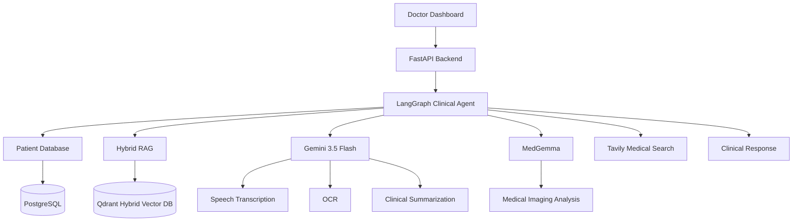

# 🩺 Synapse Clinical AI

### An Agentic Clinical Decision Support System powered by Multimodal AI

*Designed to assist clinicians through intelligent patient memory, medical imaging analysis,
speech understanding, OCR, retrieval-augmented generation, and autonomous clinical reasoning.*

---

## ✨ Overview

Modern healthcare generates enormous amounts of fragmented information—consultation transcripts, medical images, pathology reports, appointments, medications, and longitudinal patient histories.

**Synapse Clinical AI** unifies these data sources into a single AI-powered clinical workspace that assists healthcare professionals throughout the entire consultation lifecycle.

Instead of relying on a single LLM, the platform orchestrates multiple specialized AI components that collaborate to:

- 🎙️ Transcribe and summarize doctor–patient conversations
- 🩻 Analyze CT scans, MRIs, X-rays, and medical images
- 📄 Extract structured data from pathology reports using multimodal OCR
- 🧠 Retrieve longitudinal patient history using Hybrid RAG
- ⚕️ Perform clinical reasoning with specialized medical models
- 💊 Detect drug-drug interactions and allergy conflicts
- 📚 Search live medical literature for evidence-backed recommendations
- 📅 Manage appointments and longitudinal patient records

---

# 🚀 Core Capabilities

| Module | Description |
|---------|-------------|
| 🧠 Agentic Clinical Copilot | LangGraph-powered autonomous clinical assistant |
| 📄 Hybrid Medical RAG | Dense + Sparse retrieval over patient history |
| 🎙️ AI Medical Scribe | Converts consultations into structured EHR updates |
| 🩻 Medical Imaging AI | MedGemma-powered CT, MRI & X-ray interpretation |
| 📑 Lab Report OCR | Gemini Vision extracts pathology reports into structured data |
| 💊 Medication Safety | Automatic allergy & drug interaction detection |
| 🌍 Live Medical Research | Tavily-powered evidence retrieval |
| 📅 Appointment Intelligence | AI-assisted scheduling and timeline management |
| 🔐 Secure Authentication | JWT + bcrypt authentication with doctor isolation |

---

# 🏗 High-Level Architecture

---

# 🤖 AI Agent Ecosystem

Unlike traditional healthcare chatbots, Synapse uses multiple specialized AI agents.

### 🧠 Clinical Copilot
Coordinates the entire reasoning pipeline using LangGraph.

---

### 📄 Patient Retrieval Agent

Retrieves:

- Previous consultations
- Medications
- Diagnoses
- Clinical summaries
- Vector memory

using Hybrid Retrieval from Qdrant.

---

### 🎙️ Medical Scribe Agent

Automatically converts consultation audio into:

- Complete transcript
- Structured diagnoses
- Medication updates
- Appointment scheduling
- Persistent clinical memory

---

### 🩻 Imaging Agent

Uses **MedGemma** running locally through Ollama to interpret

- X-rays
- CT scans
- MRI images

and stores imaging findings inside the patient's longitudinal record.

---

### 📑 OCR Intelligence

Gemini Vision extracts structured laboratory values directly from

- Blood reports
- Pathology reports
- Clinical PDFs
- Medical Images

and automatically populates the report analyzer.

---

### 💊 Safety Agent

Before updating records the system automatically checks

- Drug-drug interactions
- Allergy conflicts
- Medication safety

and injects safety alerts into the consultation transcript.

---

### 🌍 Medical Research Agent

Searches trusted medical literature in real time using Tavily and integrates current evidence into clinical reasoning.

---

## 🚀 Platform Walkthrough

Experience the complete Synapse Clinical AI workflow—from secure authentication and patient management to AI-powered documentation and intelligent laboratory analysis.

### Click on the image for the application preview

# ⚡ End-to-End Clinical Workflow

| Step | AI Process |
|------|------------|
| 1 | Doctor logs into secure portal |
| 2 | Patient selected |
| 3 | Consultation recorded or uploaded |
| 4 | Gemini transcribes conversation |
| 5 | Clinical entities extracted |
| 6 | Medication safety validation |
| 7 | Clinical summary updated |
| 8 | Consultation indexed into Hybrid RAG |
| 9 | Patient memory refreshed |
|10 | AI Copilot answers clinician queries |
|11 | Medical images analyzed with MedGemma |
|12 | Lab reports processed via Gemini OCR |

---

# 🛠 Technology Stack

| Category | Technology |
|-----------|------------|
| LLM | Gemini 3.5 Flash |
| Clinical Vision | MedGemma (Ollama) |
| Agent Framework | LangGraph |
| LLM Framework | LangChain |
| Backend | FastAPI |
| Frontend | Streamlit |
| Database | PostgreSQL |
| Vector Database | Qdrant |
| Embeddings | FastEmbed (BGE Base) |
| Sparse Search | SPLADE |
| Authentication | JWT + bcrypt |
| ORM | SQLAlchemy |
| Search | Tavily API |
| Speech AI | Gemini Multimodal |
| OCR | Gemini Vision |

---

# 🧠 Persistent Clinical Memory

Every consultation continuously updates the patient's longitudinal record.

The platform maintains

- Clinical summaries
- Active medications
- Chronic conditions
- Imaging history
- Consultation transcripts
- Appointment timeline

allowing the AI to reason over the patient's entire medical history rather than a single conversation.

---

# 🔍 Hybrid Retrieval

Synapse combines

- Dense semantic search (BGE)
- Sparse lexical search (SPLADE)

inside **Qdrant Hybrid Retrieval** to achieve accurate retrieval across long-term patient records.

This allows the AI to retrieve both:

- semantic concepts
- exact medication names
- laboratory values
- diagnoses
- clinical terminology

before generating responses.

---

# 📸 Medical Imaging Intelligence

The imaging pipeline allows clinicians to upload

- CT
- MRI
- X-ray
- Prescription images

which are analyzed locally using MedGemma.

Generated findings are automatically attached to the patient's permanent clinical record.

---

# 📑 Intelligent Lab Report Analysis

Gemini Vision performs multimodal OCR on pathology reports and extracts structured laboratory values.

The report analyzer then

- identifies abnormal biomarkers
- detects possible deficiencies
- recommends specialist referrals
- generates downloadable PDF and JSON summaries

---

# 🔒 Security

- JWT Authentication
- bcrypt Password Hashing
- Doctor-specific data isolation
- Secure REST API
- Protected patient records

---

---

# 🚀 Future Roadmap

- Multi-hospital deployment
- FHIR / HL7 interoperability
- Native PACS integration
- ECG interpretation
- Clinical guideline engine
- Multi-agent treatment planning
- RAGAS evaluation
- Explainable AI dashboard

---

## Building the next generation of AI-assisted clinical intelligence.

**Where multimodal AI, autonomous agents, and longitudinal patient memory converge.**

